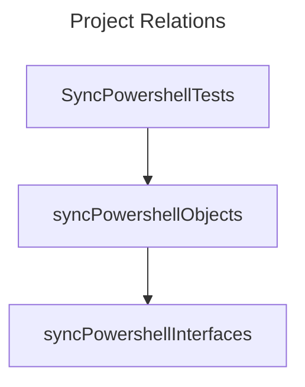
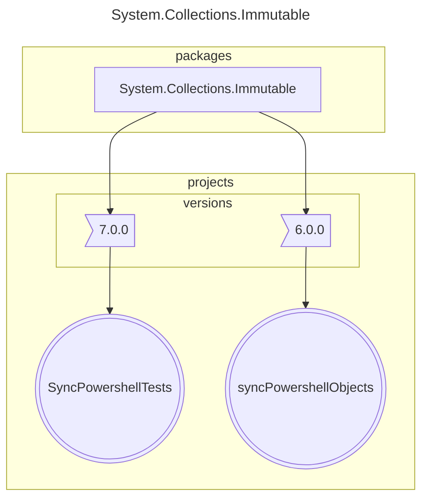
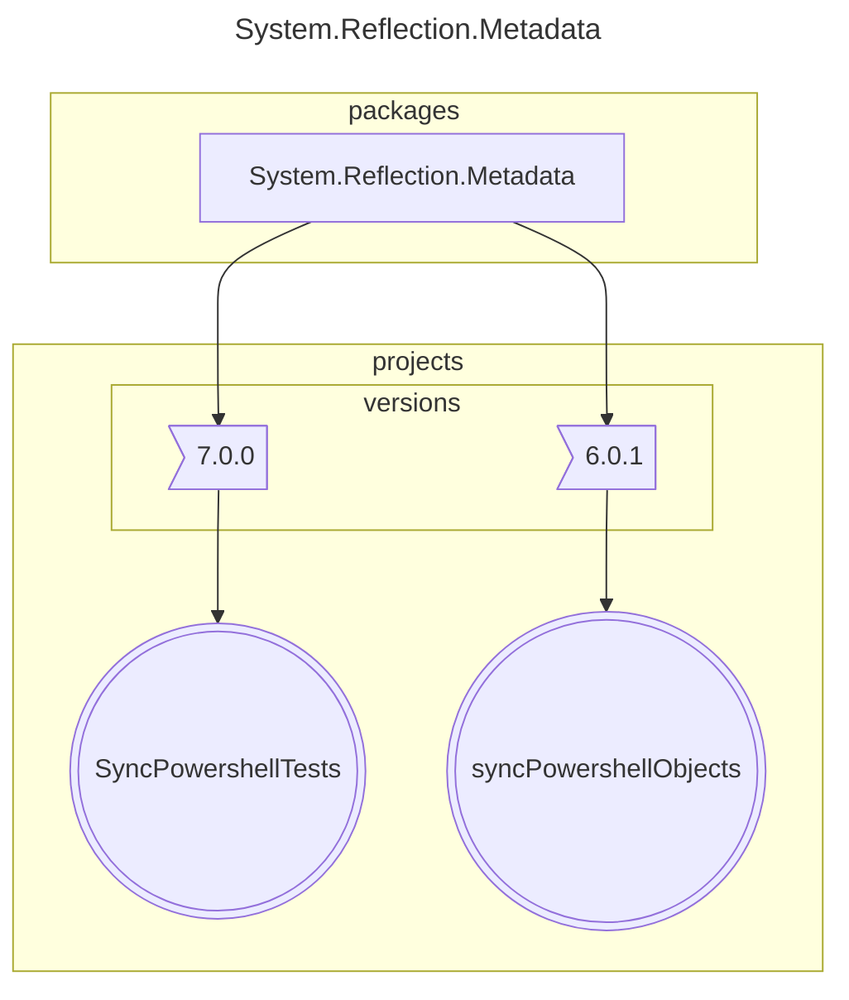

# Refactoring 

Now the project syncPowershellObjects is full of interfaces and classes. I need a refactoring - to, at least,separate interfaces from classes/implemented functionalities.

It is easy to create a new project and to add the interfaces ( with a new namespace). Somehow more difficult is to respect the rule : the interfaces must not have other the methods / properties that are not interfaces . This infers generating interfaces from classes ( VS is perfect!). 

So now is how it looks( generated with  https://www.nuget.org/packages/netpackageanalyzerconsole  )

And some major versions that differs already , even if all is targeting 7.0!

# Number of packages that differ in major version : 3

## 1 System.Collections.Immutable

## 2 System.Reflection.Metadata

## 3 System.Text.Encoding.CodePages

And here are the results of the tests:

## Feature: TestUploadAndRetrieve
	In order to sync powershell profile
	As an anonymous
	I want to send my powershell profile
	and retrieve data

### 	Scenario: TestOnePC No Powershell [UseCase002] - Passed (1s 071ms)
		Categories: TestOnePC
		Step 1: GIVEN NoPowershellProfile7 IsFound For UserName "Andrei" "TestPCAndrei" - Passed (18ms)
		Step 2: WHEN the data is sent - Passed (1s 018ms)
		Step 3: THEN the return value should be an URL Ending In UserName "Andrei" "TestPCAndrei" - Passed (2ms)

### 	Scenario: TestOnePC Powershell7 Exists [UseCase001] - Passed (1s 061ms)
		Categories: TestOnePC
		Step 1: GIVEN PowershellProfile7 IsFound For UserName "Andrei" "TestPCAndrei" [value: "text"] - Passed (2ms)
		Step 2: WHEN the data is sent - Passed (1s 048ms)
		Step 3: THEN the return value should be an URL Ending In UserName "Andrei" "TestPCAndrei" With ID - Passed (1ms)

### 	Scenario: TestOnePC Powershell7 Exists RetrieveData [UseCase003] - Passed (1s 031ms)
		Categories: TestOnePC
		Step 1: GIVEN PowershellProfile7 IsFound For UserName "Andrei" "TestPCAndrei" [value: "text"] - Passed (<1ms)
		Step 2: WHEN the data is sent - Passed (1s 012ms)
		Step 3: THEN the return value should be an URL Ending In UserName "Andrei" "TestPCAndrei" With ID - Passed (<1ms)
		Step 4: AND Can Retrieve Data [userName: "Andrei"] [pc: "TestPCAndrei"] [pwshNumber: "7"] [retValue: "text"] - Passed (5ms)

