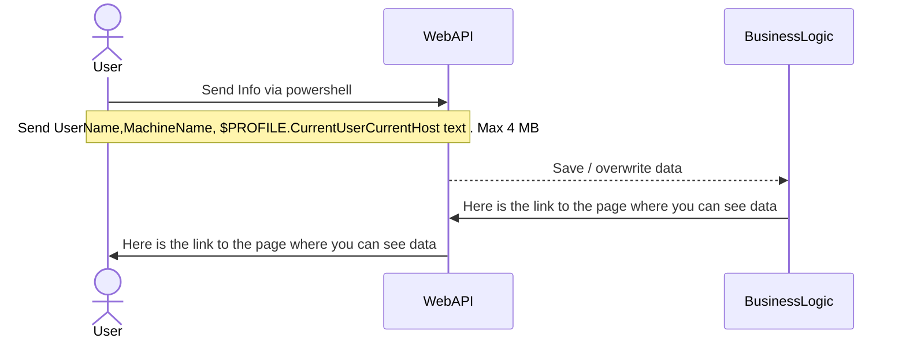

## Use Case 1 : No Authentication , upload

```mermaid
sequenceDiagram
    actor User
    User->>WebAPI: Send Info via powershell
    Note over User,WebAPI: Send UserName,MachineName, $PROFILE.CurrentUserCurrentHost text . Max 4 MB
    WebAPI-->>BusinessLogic: Save / overwrite data
    BusinessLogic->>WebAPI: Here is the link to the page where you can see data
    WebAPI->>User: Here is the link to the page where you can see data
    
```
