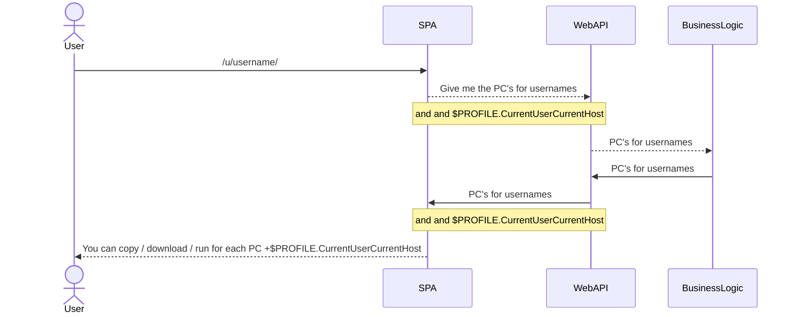

## Use case 3:  User can see data

User can  the page /userName/ the PC(s) with a link to download the file and a powershell to  execute that will overwrite on his new PC the $PROFILE.CurrentUserCurrentHost

