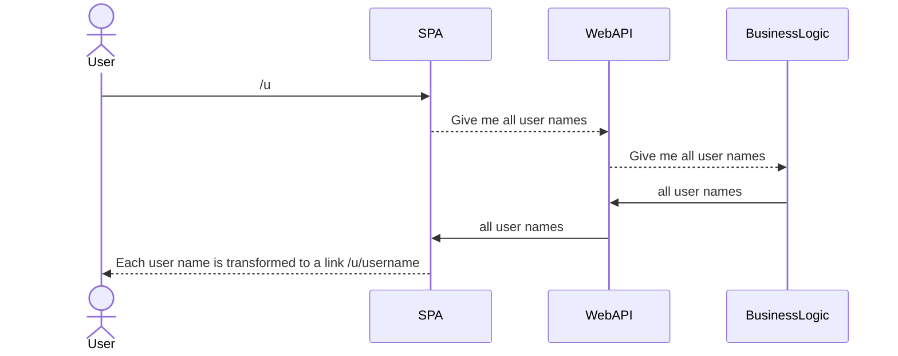

## Use case 4:  List of users

```mermaid
sequenceDiagram
    actor User
    participant SPA
    User->>SPA: /u
    SPA-->>WebAPI: Give me all user names
    WebAPI-->>BusinessLogic: Give me all user names
    BusinessLogic->>WebAPI: all user names
    WebAPI->>SPA: all user names
    SPA-->>User: Each user name is transformed to a link /u/username
```
