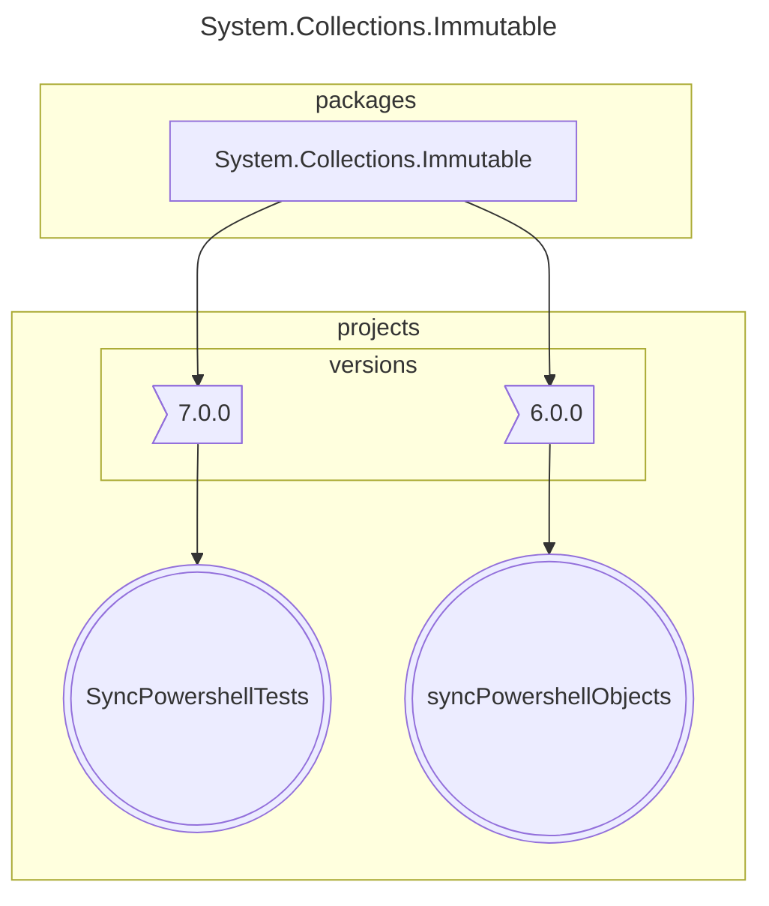
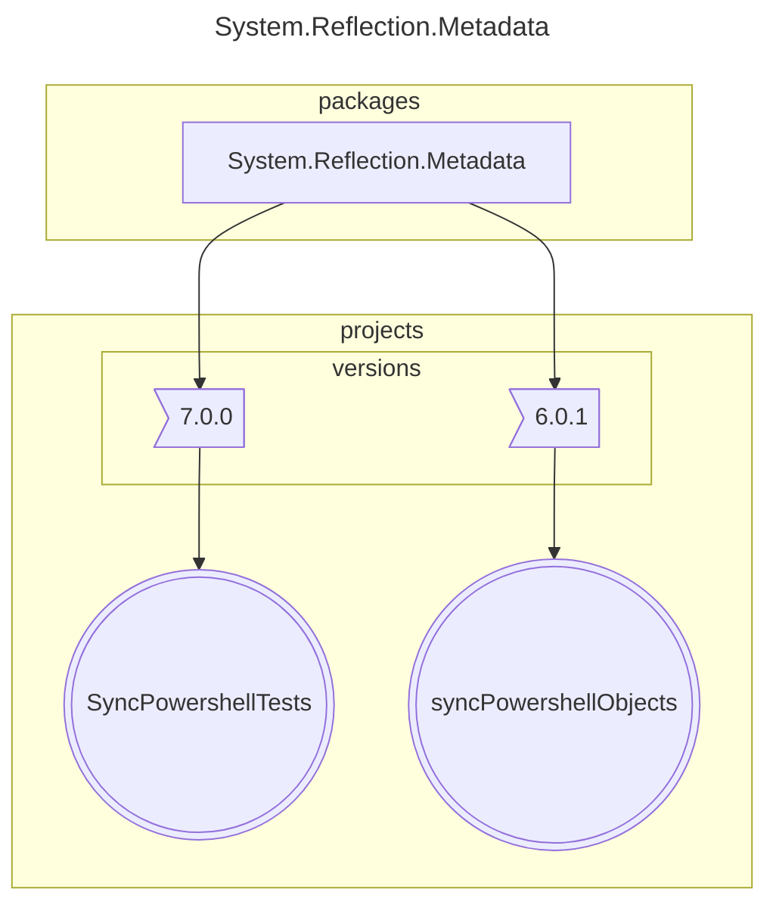

# Number of packages that differ in major version : 3

## 1 System.Collections.Immutable

## 2 System.Reflection.Metadata

## 3 System.Text.Encoding.CodePages

<small>Generated  by https://www.nuget.org/packages/netpackageanalyzerconsole , version 7.2023.830.921</small>
