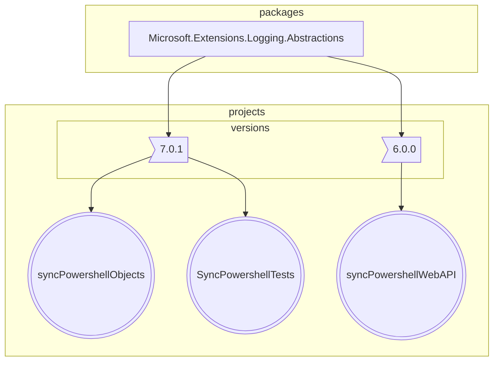
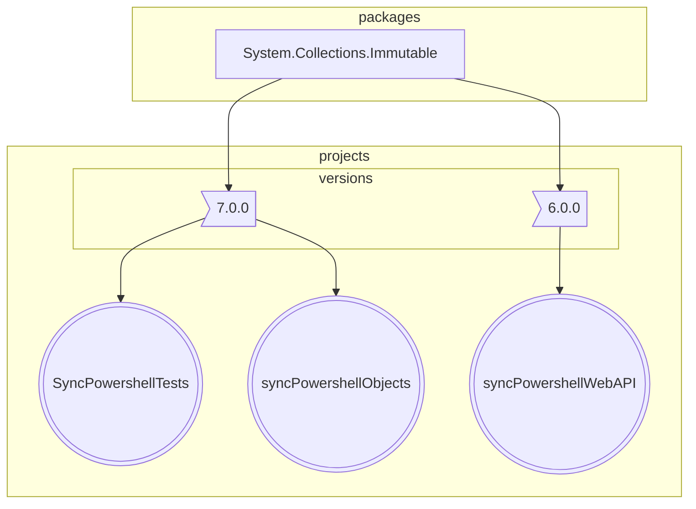
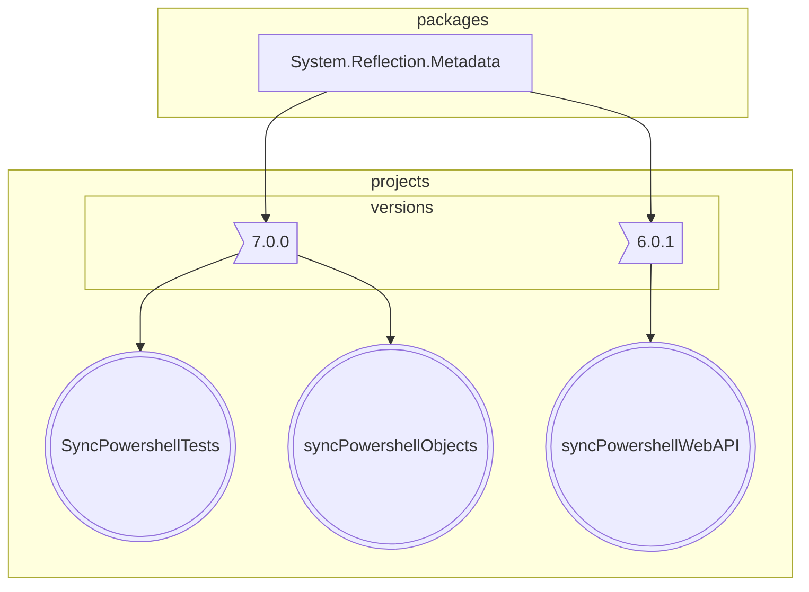
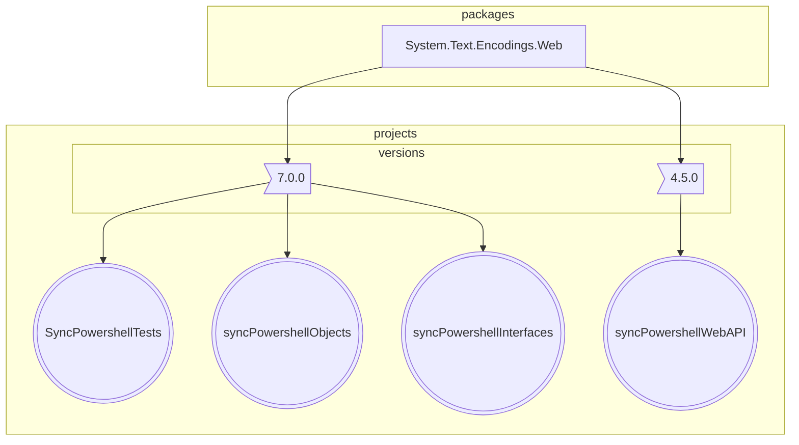

# Number of packages that differ in major version : 4

## 1 Microsoft.Extensions.Logging.Abstractions

## 2 System.Collections.Immutable

## 3 System.Reflection.Metadata

## 4 System.Text.Encodings.Web

<small>Generated  by https://www.nuget.org/packages/netpackageanalyzerconsole , version 7.2023.908.2126</small>
