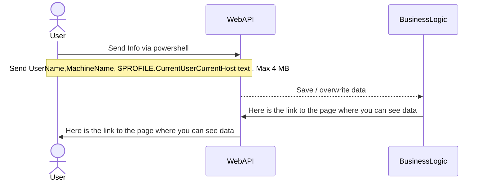

## Use Case 1 : No Authentication , upload

From his PC the user will have a powershell to send  $PROFILE.CurrentUserCurrentHost and current user name  [Environment]::UserName and PC name [Environment]::MachineName to the site ( see Use Case 3)   . The username and all data  will be deleted after 30 days . The powershell should be of max 4 MB size.

